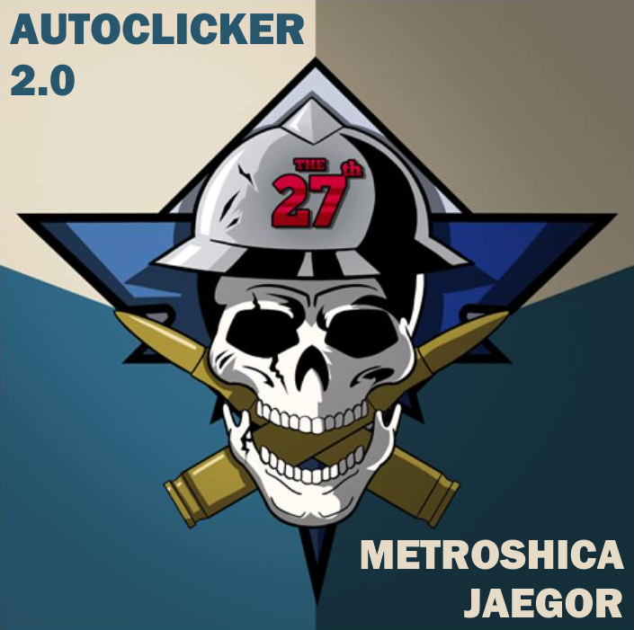
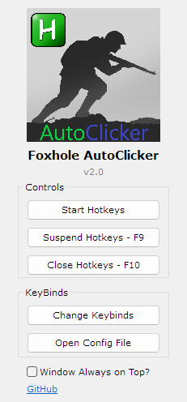
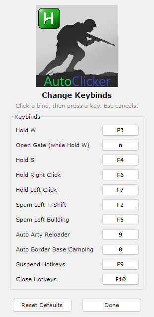

# Foxhole AutoClicker

**Tabbed-out hotkeys for [Foxhole](https://www.foxholegame.com/) — single-action autoclickers that are allowed by the game's TOS.**

&nbsp;

&nbsp;

&nbsp;&nbsp;

# How to Install
This program requires you to install [AutoHotKey](https://www.autohotkey.com/) v1. 

To install the program itself, head to the [Releases page](https://github.com/metroshica/Foxhole-AutoClicker/releases) on the right-hand side of this page. Download the most recent release, which will be a zip file named FoxholeAutoClicker. Drag the folder inside anywhere on your PC. To launch the GUI, double click the Foxhole AutoClicker file. 

# How to Use
The program comes with default keybinds, but these can easily be changed by clicking the 'Change Keybinds' button in the program. Each row shows its current key on a button — click that key, then press the key/key combination of your choice (press **Esc** to cancel). Any modifiers or extra keys (shift, alt, mouse buttons, etc.) will work. The **Reset Defaults** button restores every bind to the defaults below.

The default keybinds are:
* **F2** - Spam left click at location (holds Shift)
* **F3** - Hold W
* **F4** - Hold S
* **F5** - Left Click Building
* **F6** - Hold Right Click
* **F7** - Hold Left Click
* **9** - Auto Arty Reloader
* **0** - Auto Border Base Camping
* **F9** - Suspend Hotkeys
* **F10** - Exit Hotkeys

Any changes to your keybinds are saved in the KeyBindings.ini file, and are saved between sessions. The keys will update upon restarting the hotkeys from the GUI. 

# Changelog
Unreleased - **Spam Left Click (F2) now actually holds Shift in-game.** It presses a real Shift key for the whole spam and releases it on toggle-off (previously the game often ignored the held modifier); keep Foxhole focused while using it. **GUI redesign:** centered layout with grouped buttons, larger centered logo, bold title with version tag, the new logo as the window/tray icon, and the Maximize button disabled. **Change Keybinds page overhaul:** every bind shows its current key on a clickable "keycap" button that updates instantly when you rebind, pressing Esc now cancels a rebind (it used to blank the key), added a **Reset Defaults** button, and renamed "View Keybinds" to "Open Config File". Start/Suspend/Close now show a brief confirmation message.

v2.0 - Added two new hotkeys: Auto Arty Reloader (default `9`, spams R + left click) and Auto Border Base Camping (default `0`, spams E), each with its own button in the Change Keybinds menu. New 2.0 logo. Note: these two hotkeys send to the focused window (keep Foxhole focused), unlike the tabbed-out hotkeys.

v1.3 - F2 (Spam Left Click) now holds Shift while spamming. Hold W (F3) now also spams a configurable "Open Gate" key (default N) the whole time W is held, so gates open automatically as you run through - set the key with the GUI's "Set In-Game Open Gate Key (Hold W)" button or in `bin/KeyBindings.ini` under `[Keys] Open Gate Key`. All keybinds now fall back to their defaults if missing from the ini, so an old KeyBindings.ini won't break the hotkeys.

v1.2 - Now allows you to use the Shift key while W/S hotkeys are active, which was previously impossible. This means you can now type capital letters and more. Some shift key presses may miss, and the character will stop holding W/S for about half a second on tab out, but it is still a significant improvement.

v1.1 - Adds the "Spam Left Building" key. This key allows you to build with a hammer/shovel/etc without your character changing direction when your mouse moves.

v1.0 - Initial release.

# More Info/Troubleshooting
* This entire program is essentially two AutoHotKey scripts - one for the GUI, and one for the Foxhole hotkeys. The GUI exists to set keybinds and start/stop the hotkeys easily. You can stop/suspend either script by finding them in system tray in the bottom right of your taskbar. 

* If you don't want to use the GUI after you've set your keybinds, the script for Foxhole is located in the \bin folder, and is called FoxholeHotkeys. You can simply double click this script to launch it, and can save to taskbar by `right click > create shortcut` for it. 

* If you are familiar with AutoHotKey, or don't want to bother with the GUI at all, there is a 'manual' version of the script in the \bin folder. You can `right click > edit with ...` the FoxholeHotkeysManual script to set keybinds manually. There are instructions in the comments of the script on how to do so.

# Contact
If you have any questions, issues, or feature requests, you can open an issue on this GitHub page.

# Credits
This is a fork of the original [Foxhole AutoClicker by Tommythebold](https://github.com/Tommythebold/Foxhole-AutoClicker). Big thanks to Tommythebold for creating and maintaining the original tool that this builds on.
